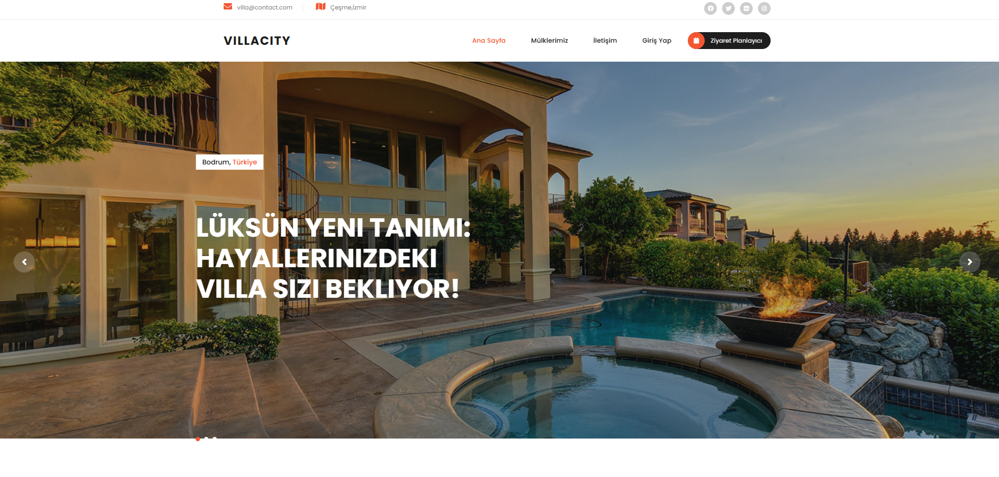
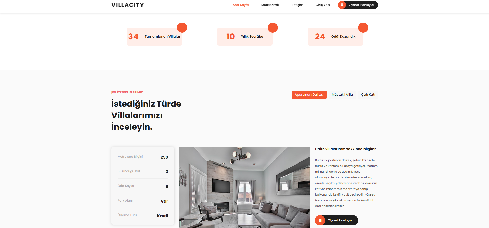
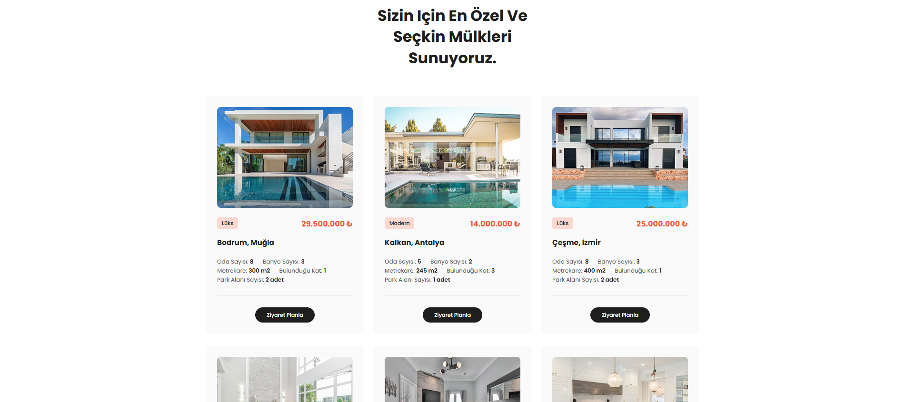
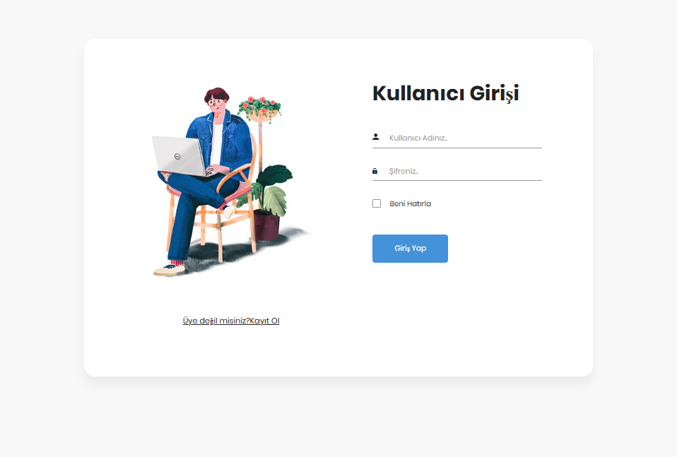

# Villa Management System Project

Welcome to the **Villa Management System** – an innovative web application designed to seamlessly manage villas. This platform provides admin users with full control over villa data, allowing them to effortlessly view, modify, and manage various aspects of the system. Built using **ASP.NET Core** and **MongoDB**, this project offers scalability and flexibility to meet future needs.

## Project Images

### 1. 

### 2. 

### 3. 

### 4. 

Project Structure & Technology Stack
Backend
ASP.NET Core: A powerful and high-performance Web API solution, designed using the MVC (Model-View-Controller) architecture and adhering to RESTful API principles. This robust framework ensures the system is scalable, maintainable, and capable of handling complex tasks with ease.

MongoDB: A next-generation NoSQL database, MongoDB provides a highly flexible and dynamic data storage solution. Its JSON-like structure allows for rapid modifications and retrieval of data, making it the perfect database choice for applications that require frequent updates and evolving schemas.

JWT Authentication: Admin users are securely authenticated using JSON Web Tokens (JWT). After logging in, users are issued a token that is used to authenticate subsequent API requests. This ensures secure, token-based access control across the entire system.

ASP.NET Core Identity: A comprehensive user authentication system powered by ASP.NET Core Identity ensures that only authorized admin users can register, log in, and access sensitive data.

Frontend
HTML, CSS, JavaScript: The user interface is designed with modern, responsive HTML, CSS, and JavaScript. These technologies ensure a smooth, seamless experience on both desktop and mobile devices.

React.js (Optional): While the primary frontend is built using standard HTML, CSS, and JavaScript, React.js (or other modern JavaScript frameworks) can be incorporated to provide a more interactive, dynamic user experience.

Database
MongoDB: MongoDB stands as the chosen database for this project due to its flexibility. It can effortlessly handle complex data structures, and it allows us to store dynamic villa data such as images, prices, and descriptions in an adaptable schema.

MongoDB C# Driver: The official MongoDB C# Driver is used for smooth, efficient communication between the backend API and the database, ensuring fast, reliable operations when accessing or modifying data.

